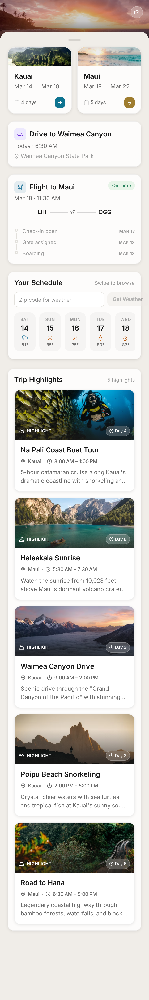
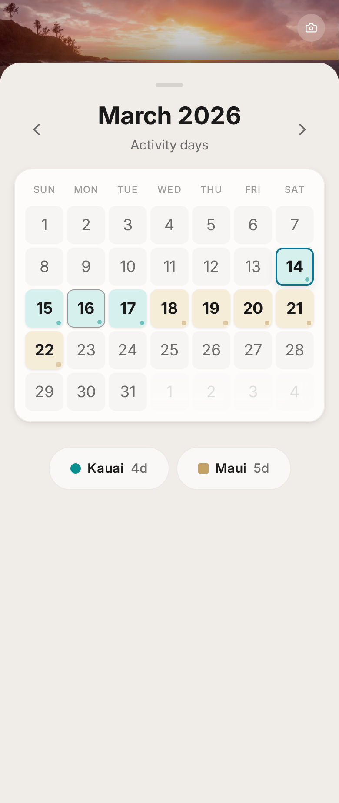
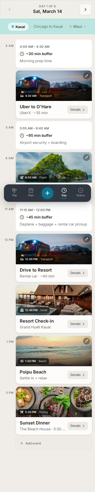
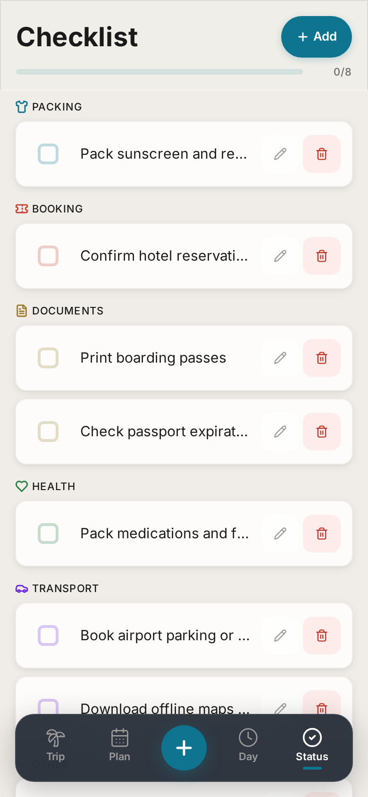

# Travel Day Organizer

A mobile-first trip planning app for managing multi-day, multi-destination itineraries. Built for a Hawaii trip across Kauai and Maui with hour-by-hour timelines, flight tracking, weather, and packing checklists.


https://github.com/user-attachments/assets/baff91a1-b53b-4f1d-b4c8-b8fcacba22d6


## Features

- **Trip Overview** — Destination cards, flight status with milestone tracking, trip countdown, weather forecast
- **Calendar View** — Month grid color-coded by destination with event density dots
- **Day Timeline** — Hour-by-hour itinerary with "Now" indicator and chronological event ordering
- **Status View** — Categorized packing checklists and document management (upload boarding passes, confirmations, etc.)
- **PWA** — Installable on mobile via "Add to Home Screen" with offline caching
- **Live Weather** — Real weather data via Open-Meteo API by zip code

## Tech Stack

- **React 19** + **Vite 7**
- **Tailwind CSS v4**
- **Framer Motion** — Page transitions and micro-interactions
- **Lucide React** — Icons
- **date-fns** — Date formatting and calendar grid

## Getting Started

```bash
npm install
npm run dev    # http://localhost:5173
```

## Build

```bash
npm run build  # Runs ESLint + Vite build
```

## Architecture

```
src/
├── App.jsx               # Root component (view router)
├── context/TripContext.jsx # Central state (useReducer + localStorage)
├── views/
│   ├── HeroView.jsx       # Trip overview
│   ├── CalendarView.jsx   # Month calendar
│   ├── DayTimelineView.jsx # Day itinerary
│   └── StatusView.jsx     # Checklists + documents
├── components/            # Reusable UI components
├── data/                  # Sample trip data, event types
├── utils/                 # Date and time utilities
├── colors.js              # Design color palette
└── styles.js              # Typography, spacing, shadow tokens
```

State-based view switching with bottom tab navigation (Trip, Calendar, Add, Day, Status). All state managed via `useReducer` with debounced `localStorage` persistence.

## Screenshots

The app is designed mobile-first (max 480px) with a tropical glassmorphism aesthetic.

<table>
  <tr>
    <td valign="top"></td>
    <td valign="top"></td>
    <td valign="top"></td>
    <td valign="top"></td>
  </tr>
  <tr>
    <td align="center"><b>Trip Overview</b></td>
    <td align="center"><b>Calendar</b></td>
    <td align="center"><b>Day Timeline</b></td>
    <td align="center"><b>Checklists</b></td>
  </tr>
</table>
